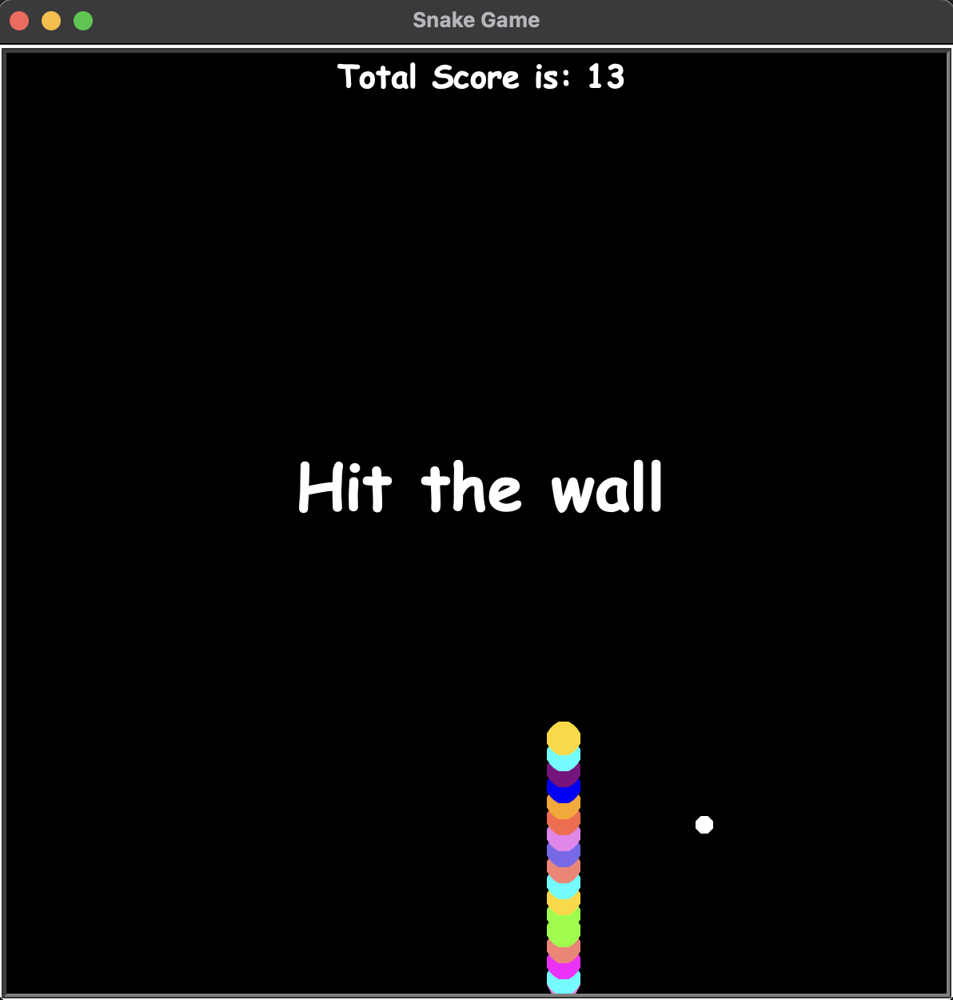
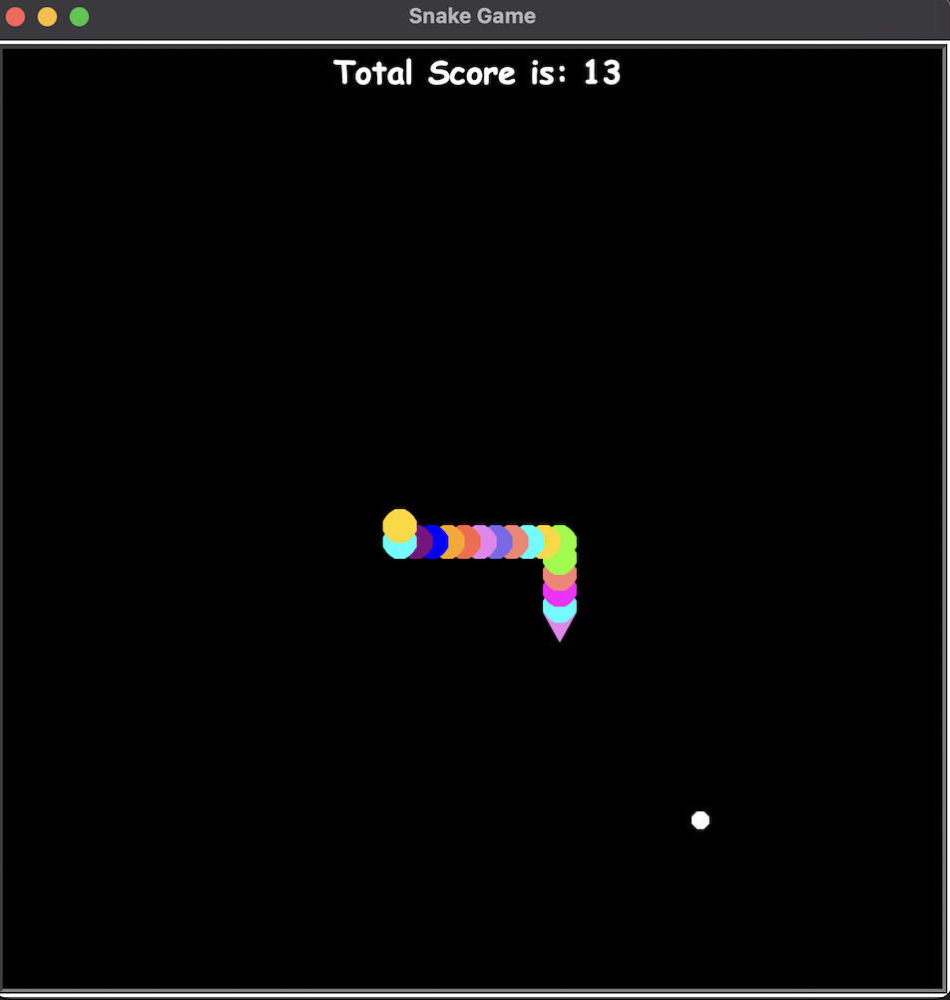
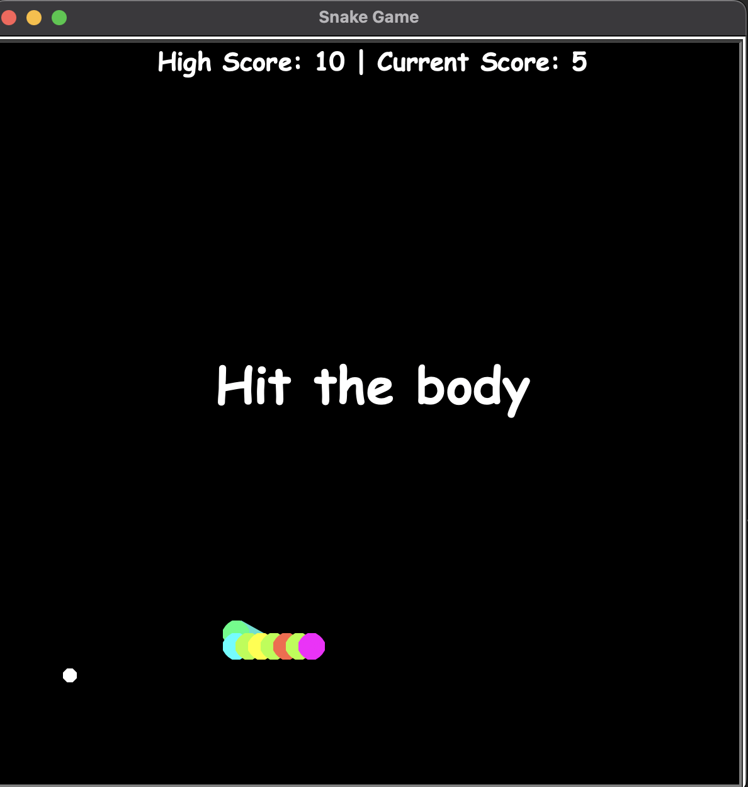

# 🐍 Snake Game (Turtle Edition)

This is a classic Snake Game built using Python's `turtle` graphics library.  
Eat the food, grow your snake, and avoid running into the wall or yourself!

---

## 📁 Project Structure

```

SnakeGame/
│
├── food.py
├── main.py
├── scoreboard.py
├── snake.py
├── 1.png
├── 2.png
├── 3.png
├── README.md

````

---

## 🎮 How to Play

- Use arrow keys to control the snake:
  - ↑ Up
  - ↓ Down
  - ← Left
  - → Right
- Eat the white food to grow your snake.
- Don’t hit the wall or your own body — or it’s game over!

---

## ▶️ Getting Started

### Requirements
- Python 3.x
- No external libraries needed — uses Python’s built-in `turtle` module.

### Run the Game

```bash
cd SnakeGame
python main.py
````

---

## 📸 Screenshots

Here’s a quick look at the game in action:

### 🐍 Hit The Wall



### 🍎 Eating Food



### 💥 Hit The Body



---

## 💡 Features

* Colorful, randomly generated snake segments
* Food spawns at random positions
* Score tracking and game-over messages
* Clean and modular code structure (easy to extend)

---

## 🧠 Possible Future Additions

* High score tracking
* Difficulty levels
* Restart option on game over
* Sound effects and animations

---

## 👨‍💻 Author

Made with ❤️ in Python Turtle

---

## 📄 License

This project is free to use and modify for educational or personal use.
