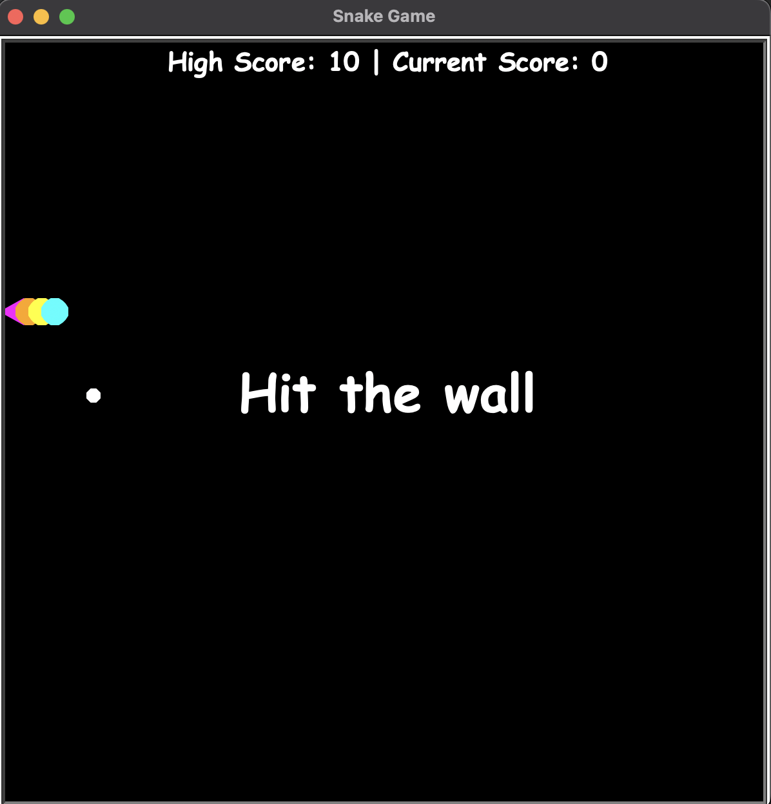
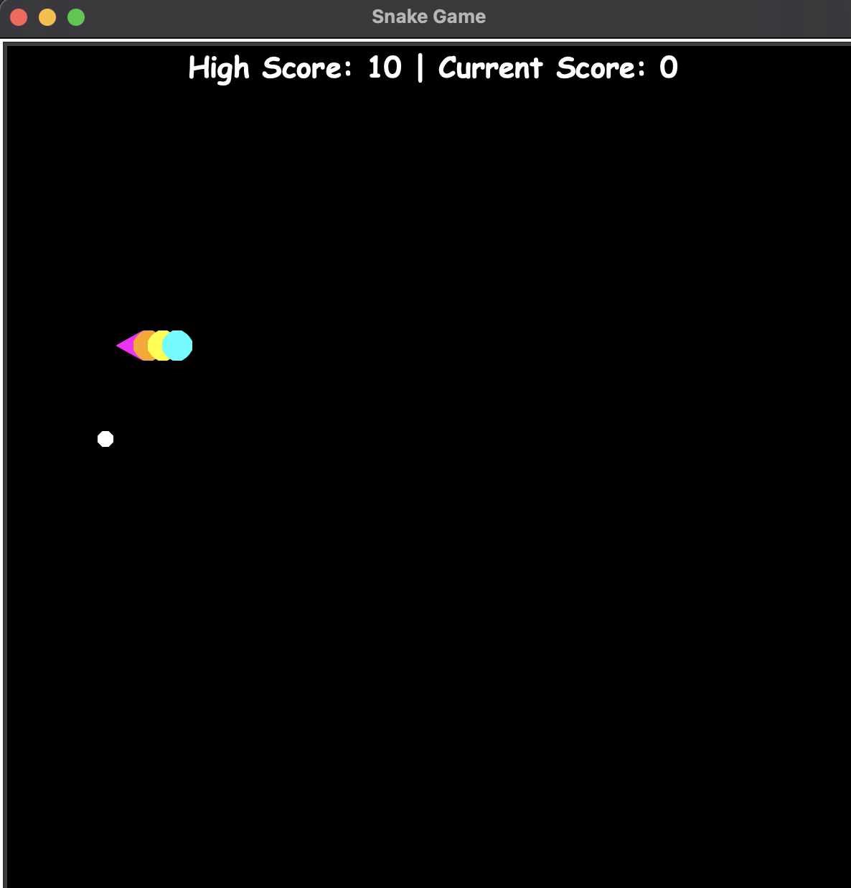

# 🐍 Snake Game (Turtle Edition)

This is a classic Snake Game built using Python's `turtle` graphics library.  
Eat the food, grow your snake, and avoid running into the wall or yourself!

---

## 📁 Project Structure

```

SnakeGame/
│
├── food.py
├── main.py
├── scoreboard.py
├── snake.py
├── 1.png
├── 2.png
├── 3.png
├── README.md

````

---

## 🎮 How to Play

- Use arrow keys to control the snake:
  - ↑ Up
  - ↓ Down
  - ← Left
  - → Right
- Eat the white food to grow your snake.
- Don’t hit the wall or your own body — or it’s game over!

---

## ▶️ Getting Started

### Requirements
- Python 3.x
- No external libraries needed — uses Python’s built-in `turtle` module.

### Run the Game

```bash
cd SnakeGame
python main.py
````

---

## 📸 Screenshots

Here’s a quick look at the game in action:

### 🐍 Hit The Wall



### 🍎 Eating Food



### 💥 Hit The Body


---

## 💡 Features

* Colorful, randomly generated snake segments
* Food spawns at random positions
* Score tracking and game-over messages
* Clean and modular code structure (easy to extend)
* File read and write for saving previous high score count

---

## 💡File Saving & Loading

The game maintains a high score stored in the file SnakeData.txt located in the SnakeGame folder.
When the game starts, it reads the high score from this file:
          
```
with open("SnakeGame/SnakeData.txt", "r") as file:
    high_score = int(file.read())
```

When a new high score is achieved, it updates the file:
          
```
with open("SnakeGame/SnakeData.txt", "w") as file:
    file.write(str(new_high_score))
```
---

## 🧠 Possible Future Additions

* Difficulty levels
* Restart option on game over
* Sound effects and animations

---

## 👨‍💻 Author

Made with ❤️ in Python Turtle

---

## 📚 Acknowledgements

This project is inspired by a Python course I'm following. Some parts of the code structure are based on the course, but I’ve made key modifications and added features to better understand and practice Python development.

Thanks to the course creator(s) for the foundational learning!

---

## 📄 License

This project is free to use and modify for educational or personal use.
